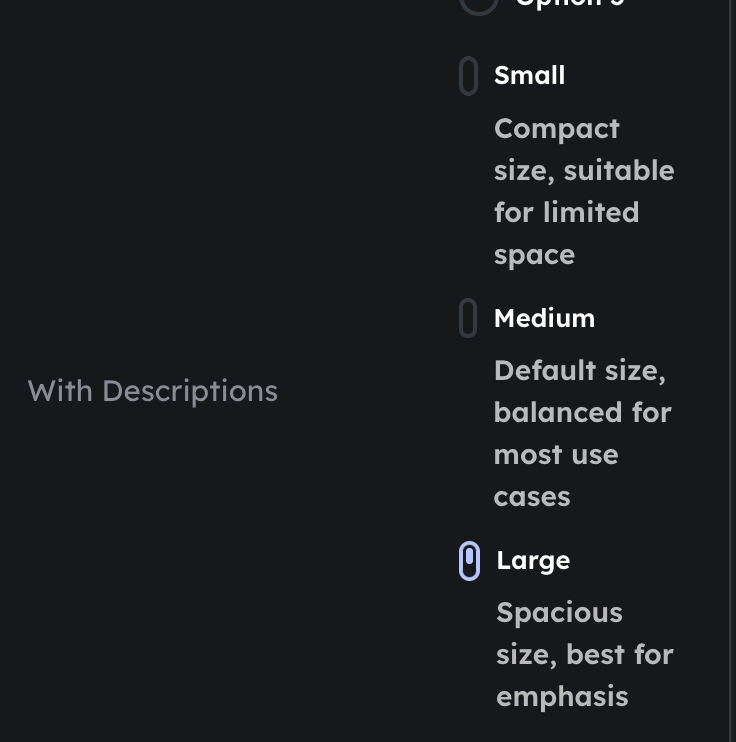

---
# sendou.ink-i6lm
title: Radio buttons and similar components get squished on mobile
status: todo
type: bug
created_at: 2026-01-15T19:29:55Z
updated_at: 2026-01-15T19:29:55Z
---

Some components like radio buttons get squished when there is no horizontal space available on mobile devices. This affects usability and visual appearance on smaller screens.

## Screenshots

## Checklist

- [ ] Identify affected components (radio buttons, checkboxes, etc.)
- [ ] Investigate root cause of squishing behavior
- [ ] Implement fix to ensure components maintain minimum size
- [ ] Test on various mobile viewport widths
