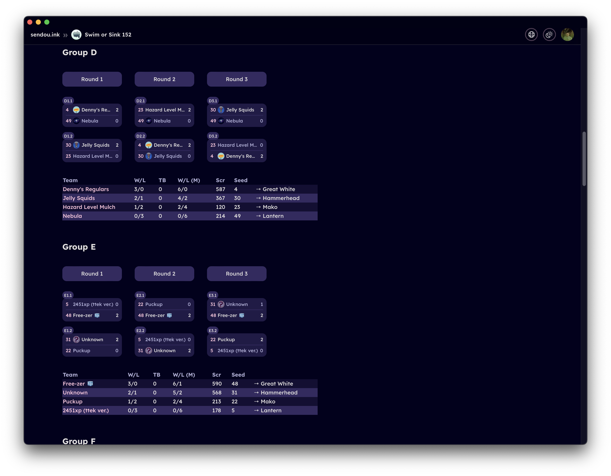
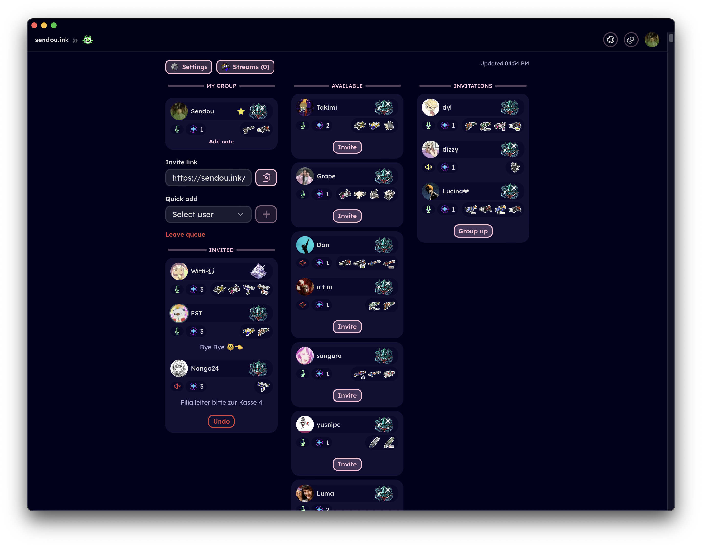
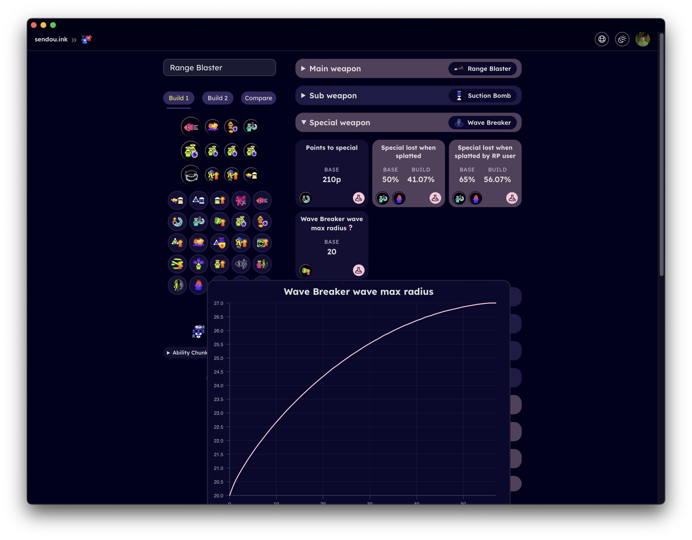

<center></center>

<a href="https://sendou.ink" target="_blank" rel="noreferrer">sendou.ink</a> - a Splatoon platform with competitive focus

What differentiates sendou.ink from some other gaming platforms (e.g. tournament hosting platforms) is its 100% focus on Splatoon. This allows for more custom tailored experience around the game and the community. The wide range of distinct features make it possible to create seamless integrations between them further enriching the user experience beyond what external integrations would allow.

Another key objective is to bridge the gap between casual and competitive players. For example, features like a gear build simulator can appeal not only to competitive players but also to those who simply want to enhance their gameplay without participating in tournaments. This allows sendou.ink to be useful for a wider audience but also provides a window to the competitive side of things for those that might be interested.

<details>
<summary>Screenshots</summary>





</details>

<details>
<summary>Selected features</summary>

- Full tournament system
   - Automatic bracket progression
   - Single Elimination, Double Elimination, Round Robin, Swiss
   - Splatoon specific maplists (picked by the organizer or teams)
   - Counterpicking of different styles
   - Automatic seeding tool
   - Ranked tournaments allowing users to climb the leaderboard
   - View streams of tournament (both participants and the cast)
- Seasonal ladder system
   - Join by yourself or with 1-3 of your mates, get a full group and challenge other teams
   - View streams of ongoing matches
   - Maplist generation based on given preferences
   - Private notes
- Map planner that lets you draw on maps and insert weapons
- Map list generation tool
- Win badges from tournaments, management tools for TOs
- Calendar to find out upcoming events to play in
- Event result reporting
- Plus Server for top players "looking for group purposes" voting and suggestion tools.
- User pages
- User search
- "LFG", make a post to find people to play with
- Scrim scheduler
- Form teams (featuring uploading profile and banner pictures)
- Object Damage Calculator (how much does each weapon deal vs. different objects)
- Build Analyzer (exact stats of your builds)
- Add and search for videos by weapon, stage, player and more
- Auth via Discord
- Light and dark mode
- Localization

</details>

## Running locally

### Prerequisites

- [Git](https://git-scm.com/)
- [Node.js v22](https://nodejs.org/en)

Optionally [nvm](https://github.com/nvm-sh/nvm) can be convenient for managing multiple Node.js installs

### Commands

First verify you have Node.js and git installed:

```bash
node --version
git --version
```

You should see something like:

```
v22.13.0
git version 2.39.5 (Apple Git-154)
```
(if not then go back to "Prerequisites" and install what is missing)

Then there is a sequence of commands you need to run:

```bash
git clone https://github.com/Sendouc/sendou.ink.git # Clones repository
cd sendou.ink # Change to the project's folder
npm install # Install dependencies
npm run dev # Setup the development environment and run the project
```

You should then be able to access the application by visiting http://localhost:5173

Use the admin panel at http://localhost:5173/admin to log in (impersonate) as the admin user "Sendou" or as a regular user "N-ZAP" as well as re-seed the database if needed.

### Development Container (Recommended)

This project includes a development container configuration that provides a consistent development environment. Using the development container is recommended, especially for new contributors, as it ensures everyone has the same development setup and eliminates common environment-related issues.

To use it:

1. Install [Docker](https://www.docker.com/products/docker-desktop)
2. Install [VS Code](https://code.visualstudio.com/)
3. Install the [Remote - Containers](https://marketplace.visualstudio.com/items?itemName=ms-vscode-remote.remote-containers) extension
4. Open the project in VS Code
5. When prompted, click "Reopen in Container" or use the command palette (F1) and select "Remote-Containers: Reopen in Container"

The container will automatically set up all required dependencies and configurations, including Node.js, SQLite, and Playwright for testing.

## Contributing

- **Developers**: Read [CONTRIBUTING.md](./CONTRIBUTING.md)
- **Translation**: Read [translation.md](./docs/translation.md)
- **Article writing**: Read [articles.md](./docs/articles.md)

For developers reading the [architecture.md](./docs/dev/architecture.md) file is highly recommended to get up to the speed with how the project folder structure works and getting familiar with its concepts.

## Tech stack

- **Language**: TypeScript
- **Frameworks**: Node.js, React, Remix
- **UI Library**: React Aria Components
- **Database**: SQLite3 (via Kysely)
- **Styling**: CSS Modules
- **Validation**: Zod
- **Internationalization**: i18next
- **Testing**:
   - End-to-End (E2E): Playwright
   - Unit/Integration: Vitest
