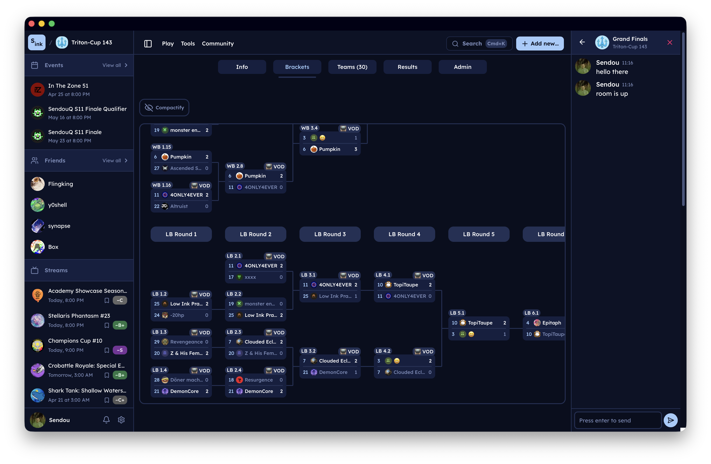
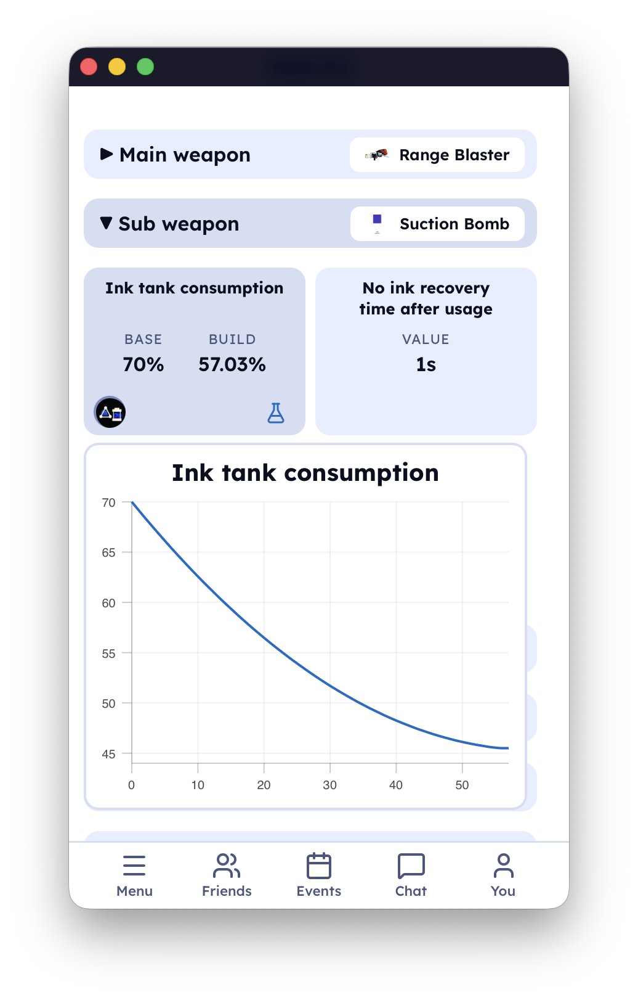

<center></center>

<a href="https://sendou.ink" target="_blank" rel="noreferrer">sendou.ink</a> - a Splatoon platform with competitive focus

What differentiates sendou.ink from some other gaming platforms (e.g. tournament hosting platforms) is its 100% focus on Splatoon. This allows for more custom tailored experience around the game and the community. The wide range of distinct features make it possible to create seamless integrations between them further enriching the user experience beyond what external integrations would allow.

Another key objective is to bridge the gap between casual and competitive players. For example, features like a gear build simulator can appeal not only to competitive players but also to those who simply want to enhance their gameplay without participating in tournaments. This allows sendou.ink to be useful for a wider audience but also provides a window to the competitive side of things for those that might be interested.

<details>
<summary>Screenshots</summary>




</details>

<details>
<summary>Selected features</summary>

- Full tournament system
   - Automatic bracket progression
   - Single Elimination, Double Elimination, Round Robin, Swiss
   - Splatoon specific maplists (picked by the organizer or teams)
   - Counterpicking of different styles
   - Automatic seeding tool
   - Ranked tournaments allowing users to climb the leaderboard
   - View streams of tournament (both participants and the cast)
- Seasonal ladder system
   - Join by yourself or with 1-3 of your mates, get a full group and challenge other teams
   - View streams of ongoing matches
   - Maplist generation based on given preferences
   - Private notes
- Map planner that lets you draw on maps and insert weapons
- Map list generation tool
- Win badges from tournaments, management tools for TOs
- Calendar to find out upcoming events to play in
- Event result reporting
- Plus Server for top players "looking for group purposes" voting and suggestion tools.
- User pages
- User search
- "LFG", make a post to find people to play with
- Scrim scheduler
- Form teams (featuring uploading profile and banner pictures)
- Object Damage Calculator (how much does each weapon deal vs. different objects)
- Build Analyzer (exact stats of your builds)
- Add and search for videos by weapon, stage, player and more
- Auth via Discord
- Light and dark mode
- Localization

</details>

## Running locally

### Prerequisites

- [Git](https://git-scm.com/)
- [Node.js v24](https://nodejs.org/en) (see [.nvmrc](./.nvmrc) for the exact version)
- [pnpm](https://pnpm.io/installation)

Optionally [nvm](https://github.com/nvm-sh/nvm) can be convenient for managing multiple Node.js installs

### Commands

First verify you have Node.js and git installed:

```bash
node --version
git --version
pnpm --version
```

You should see something like:

```
v24.18.0
git version 2.39.5 (Apple Git-154)
10.33.0
```
(if not then go back to "Prerequisites" and install what is missing)

Then there is a sequence of commands you need to run:

```bash
git clone https://github.com/sendou-ink/sendou.ink.git # Clones repository
cd sendou.ink # Change to the project's folder
pnpm install # Install dependencies
pnpm dev # Setup the development environment and run the project
```

You should then be able to access the application by visiting http://localhost:5173

Use the admin panel at http://localhost:5173/admin to log in (impersonate) as the admin user "Sendou" or as a regular user "N-ZAP" as well as re-seed the database if needed.

#### Environment variables

You don't need a `.env` file to get started. Default values for every environment variable are defined in [`app/config.ts`](./app/config.ts) (client `VITE_*` variables) and [`app/config.server.ts`](./app/config.server.ts) (server variables), and the development defaults are enough to run the app.

To override any of them, create a `.env` file in the project root — see [`.env.example`](./.env.example) for the available variables. Some features (Discord login, image upload, chat) need real values or local services to actually work; without them the app still runs with those features disabled.

In production these variables are read from the host environment, and the ones marked as required will fail fast at startup with a clear error if they are missing.

#### Static assets

Static assets (weapon, gear and stage images, badges, sounds, etc.) are not stored in this repository. They live in [sendou-ink/assets](https://github.com/sendou-ink/assets) and are served from a CDN. The base URL is configurable via the `VITE_STATIC_ASSETS_URL` environment variable, which defaults to the production CDN so the app works out of the box without any local setup.

#### Docker

Optionally, if you want to develop image upload, real-time features or chat, you can use Docker to spin up the Skalop service and Minio for image hosting. You will need [Docker](https://www.docker.com/) up and running and then run the following command:

```
docker compose up -d
```

Minio admin UI to manage uploaded photos should be up and running at http://localhost:9001

#### Windows performance tips

The dev server does many small file operations which are slower on Windows by default. Two optional tweaks can improve performance:

**Windows Defender exclusions**

Excluding the project folder and the pnpm store from Windows Defender speeds up installs, dev server startup and first navigations. In a PowerShell ran as administrator:

```powershell
Add-MpPreference -ExclusionPath "C:\path\to\sendou.ink"
Add-MpPreference -ExclusionPath "$(pnpm store path)"
```

Be aware that excluded folders are not scanned at all, and compromised npm packages can land in `node_modules`. This should not be much of an issue since pnpm does not allow running dependency lifecycle scripts unless explicitly allowed, and exact dependency versions are being pinned by the lockfile, but it should be kept in mind.  
Undo at any time with `Remove-MpPreference -ExclusionPath "..."`.

**Dev Drive**

Alternatively, keep the repository on a [Dev Drive](https://learn.microsoft.com/en-us/windows/dev-drive/). On a Dev Drive, Defender scans files asynchronously instead of blocking, so you keep most of the speedup without giving up scanning entirely.

## Contributing

- **Developers**: Read [CONTRIBUTING.md](./CONTRIBUTING.md)
- **Translation**: Read [translation.md](./docs/translation.md)
- **Article writing**: Read [articles.md](./docs/articles.md)

For developers reading the [architecture.md](./docs/dev/architecture.md) file is highly recommended to get up to the speed with how the project folder structure works and getting familiar with its concepts.

## Tech stack

- **Language**: TypeScript
- **Frameworks**: Node.js, React, Remix
- **UI Library**: React Aria Components
- **Database**: SQLite3 (via Kysely)
- **Styling**: CSS Modules
- **Validation**: Zod
- **Internationalization**: i18next
- **Testing**:
   - End-to-End (E2E): Playwright
   - Unit/Integration: Vitest
