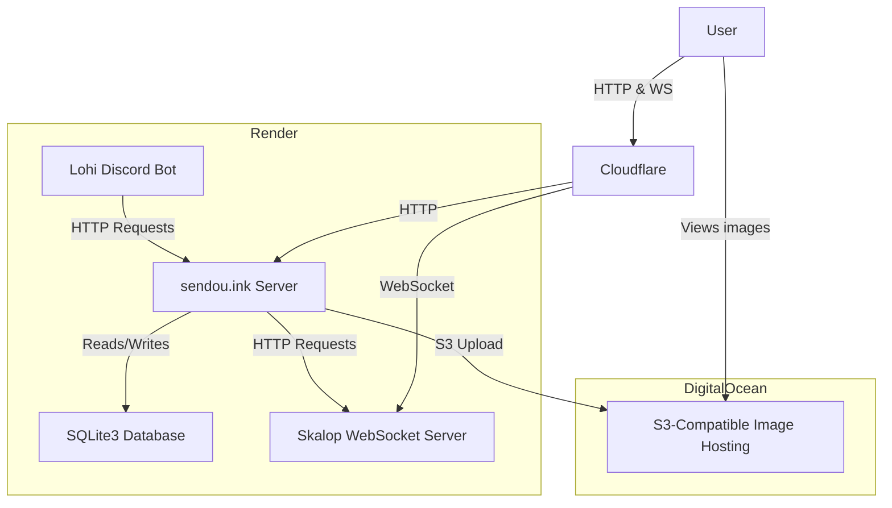

# Architecture

Note: some code in the project is older and some newer. Not everything follows the concepts and structure as explained here. PR's welcome to improve the situation.

## Diagram

Here is how the application architecture looks like in production.



List of the dependencies in production:

- [Skalop](https://github.com/Sendouc/skalop) - WebSocket server
- [Lohi](https://github.com/Sendouc/lohi) - Discord bot for profile updates, log-in links etc.
- [Leanny/splat3](https://github.com/Leanny/splat3) - In-game data (manual update) 
- [splatoon3.ink](https://github.com/misenhower/splatoon3.ink) - X Rank placement data (manual update)
- Discord - Auth  
- Twitch - Streams  
- Bluesky - Front page changelog

## Folder structure

```
sendou.ink/
├── app/
│   ├── components/ -- React components used by many features
│   │   └── elements/ -- Wrappers providing styling etc. around React Aria Components
│   ├── db/ -- Database seeds, types & connection
│   ├── features/ -- See "feature folders" below
│   ├── hooks/ -- React hooks used by many features
│   ├── modules/ -- "node_modules but part of the app"
│   ├── styles/ -- Global .css files
│   ├── utils/ -- Helper functions grouped by domain used by many features
│   ├── entry.client.tsx -- Client entry point (Remix concept)
│   ├── entry.server.tsx -- Server entry point (Remix concept)
│   ├── root.tsx -- Basic HTML structure, React context providers & root data loader
│   └── routes.ts -- Route manifest
├── content/ -- Markdown files containing articles
├── docs/ -- Documentation to developers and users
├── e2e/ -- Playwright tests
├── locales/ -- Translation files
├── migrations/ -- Database migrations
├── public/ -- Images, built assets etc. static files to be served as is
├── scripts/ -- Stand-alone scripts to be run outside of the app (i.e. not imported)
└── types/ -- "global" type overwrites
```

## Feature folders

Feature folders collect together all the code needed to make that particular feature happen: database, backend, frontend, core logic etc. Feature can mean an user facing feature like "map-planner" but also something of a more cross-cutting concern like "chat".

You should aim to colocate code that "changes together" as much as possible. Features can depend (import) on other features. 

### Feature folder files & folders

- **actions/**: Remix actions per route
- **components/**: React components
- **core/**: "Core logic" meaning modules (see below) or other logic that is not typically rendering components or calling database
- **queries/**: (deprecated) Database queries, should use repository instead
- **loaders/**: Remix loaders per route
- **routes/**: Remix actions per route
- **FeatureRepository.server.ts**: Database queries & mappers
- **feature-constants.ts**: Constant values
- **feature-hooks**: React hooks
- **feature-schemas.ts**: Zod schemas for validating form values, params, payloads
- **feature-types.ts**: Typescript types
- **feature-utils.ts**: Utilities too small to make up for their own modules
- **feature.css**: (deprecated) CSS, should use CSS modules instead

Note: we are not using file-based routing. To add a new route `routes.ts` needs to be updated  
Note: a route file needs to re-export the action/loader of that route

### Feature modules

Define in a core folder:

```ts
// app/features/cool-feature/core/Module.ts

/** Descriptive JSDoc goes here */
export function doTheThing() {

}
function implementationDetail() {

}
```

You should document any functions exported by the module well.

Usage:

```ts
// anywhere else in the codebase, particularly inside that feature
import * as Module from "../core/Module.ts"

Module.doTheThing()
```

## Concepts

### Testing

Testing is important part of every feature work. The approach the project takes is pragmatic not super focused on writing test for every single thing but especially more mission critical features should have a better test coverage. E.g. if a tournament is canceled due to a bug that can mean a lot of lost confidence from users and waste of time but if some "edge of the system" type of feature has small graphical bugs we can just fix that on user feedback.

Unit testing "core logic" (i.e. no React, no DB calls) with Vitest is highly encouraged whenever feasible. Most tests are like this.

Vitest can also be used to write "integration tests" that call mocked actions/loaders (see `admin.test.ts` for example). This uses in-memory SQLite3. In practice this is best sparingly as they are typically slower than pure unit tests with more dependencies but also don't test the true end to end flow.

Which brings us to E2E tests. For new features at least testing the happy path is encouraged. For more critical features (mainly tournament related stuff) it makes sense to test a bit more rigorously.

See: [Playwright best practices](https://playwright.dev/docs/best-practices)

### Authentication

Accessing logged in user in React components:

```tsx
const user = useUser();
```

Accessing logged in user in loaders/actions:

```ts
const user = await requireUser(request); // get user or throw HTTP 401 if not logged in
const user = await getUser(request); // get user (undefined if not logged in)
```

### Permissions

1) Add a permission object in a `Repository` code.
2) Read in React code via the `useHasPermission` hook.
3) Read in server code via the `requirePermission` guard.

User can also have global roles such as "staff" or "tournament adder". Set in the root loader and `getUser`/`requireUser` code.

### Anatomy of an action

TODO (after React server actions in use)

### Performance

Keeping server performance in mind is always necessary. Due to the monolithic nature of the server one badly optimized endpoint impacts all other routes.

Use a load testing tool like `autocannon` to ensure new features scale.

### Database

Sendou.ink uses SQLite3 for its database solution. See for example ["Consider SQLite"](https://blog.wesleyac.com/posts/consider-sqlite) for motivation why to pick SQLite for a web project over something like PostgreSQL. Tldr; for a project of this scale it gets you far, low latency when accessing data store & simplifies testing when your database is just a file on the filesystem. When writing code it should be kept in mind that writes to the database are not concurrent so abusing the database can lead to the whole web server process freezing essentially.

Check `database-relations.md` for more information about the database relations. See `tables.ts` for documentation on tables and columns.

### React guidelines

- Write modern React code as described by the documentation e.g. [seldom using useEffect](https://react.dev/learn/you-might-not-need-an-effect)
- We use React Compiler so writing memos manually (useMemo, useCallback, React.memo) should normally not be needed
- Structuring longer components to sub-components located in the same file is encouraged

### State management

We are not using a state management library such as Redux. Instead use React Context for the few global state needed and Remix's data loading hooks to share the state loaded from server. See also "Search params" section below.

### Search params

Often it's convenient to store state in search params. This allows for nice features like users to deep link to the view they are seeing. You have two options to achieve this:

1) Use Remix's built-in solution. Use this if data loaders should rerun once search params are changed.
2) `useSearchParamState` hook. Use this if it is not needed.

### Routines

Cron jobs to perform actions on the server at certain intervals. To add a new one, add a new file exporting an instance of the `Routine` class then add it to the appropriate array in the `app/routines/list.server.ts` file.

### Real time

Webhooks via Skalop service (see logic in the Chat module).

Old way: server-sent events still in use for tournament bracket & match pages.

### Notifications

Both in-app and browser notifications. See `/app/features/notifications`. Good for notifying user about actions that they are interested in that might have happened when they are offline.
