Note: some simple features omitted with only a few relations and no special notes

See `tables.ts` for some more documentation on column-level.

## Art

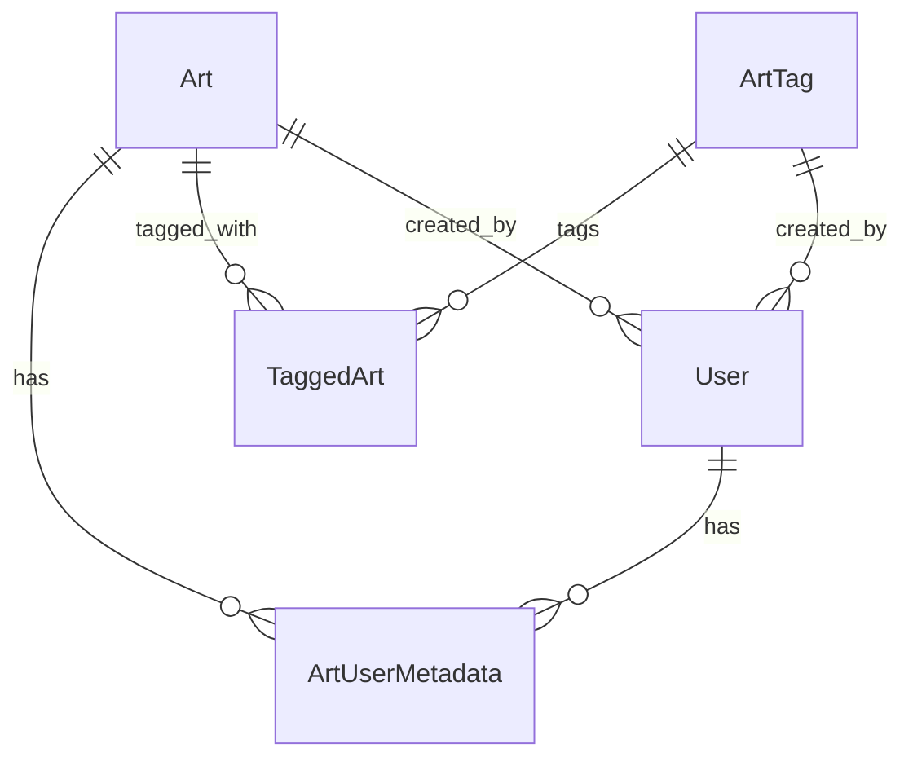

## Badges

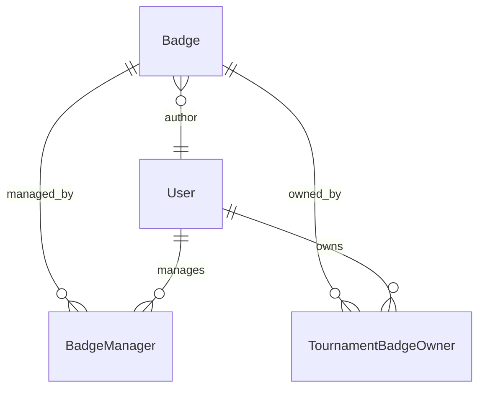

- **BadgeOwner** - Tournament badges with supporter badges included from user's supporter status

## Builds

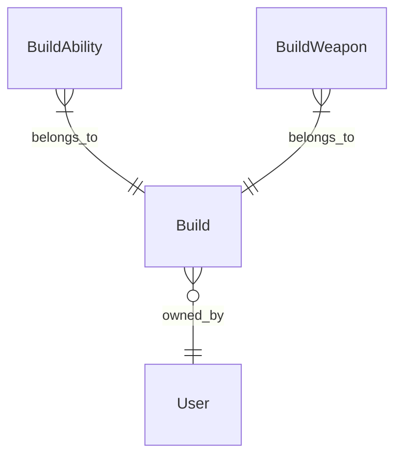

## Calendar Events

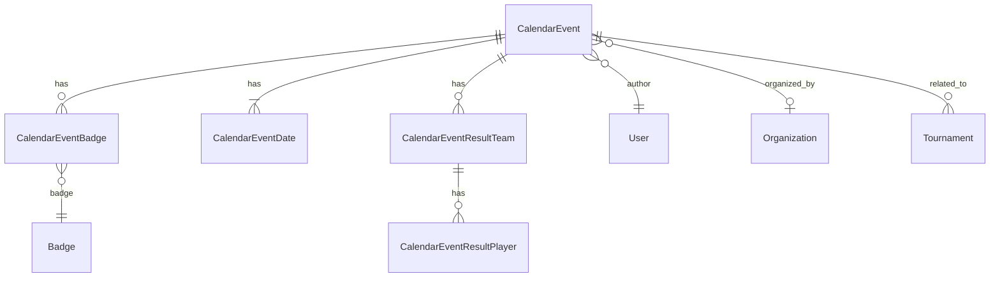

### Notes

- "Calendar event result" concept is only for tournaments not hosted on sendou.ink
- Regular calendar event can have many dates, tournaments only one

## Groups (SendouQ)

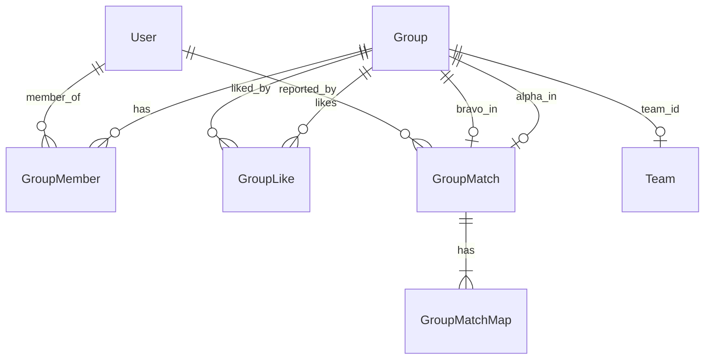

### Notes

- Even if a group rejoins the queue with the same players after the match, a new "Group" is created in the DB

## LFG Posts

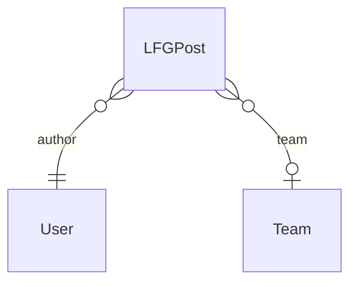

## Map Pools

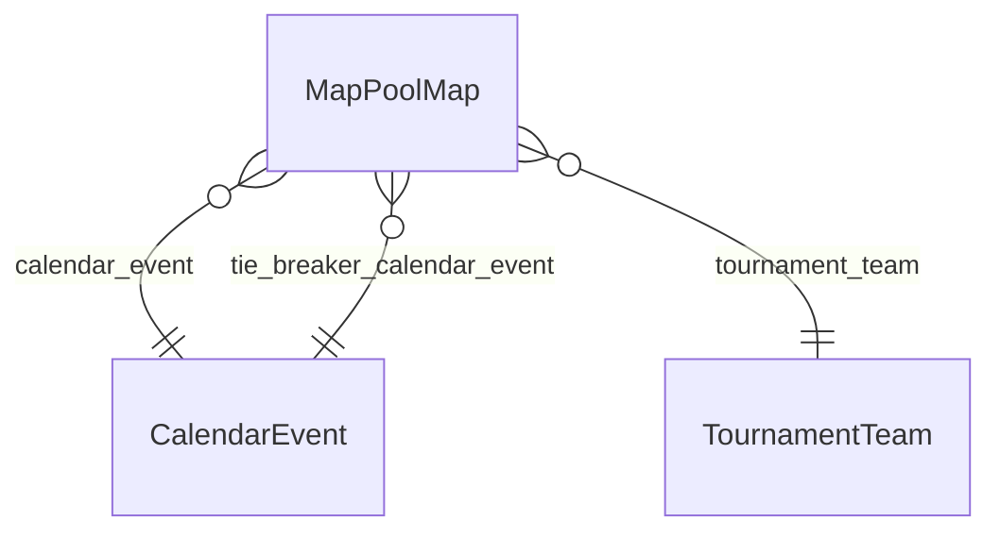

### Notes

Can be one of the following:
1) Regular calendar events map pool
2) Tournament's tiebreaker maps (teams' pick mode, AUTO_ALL)
3) Tournament's map pool (TO's map picking mode)
4) Tournament teams map picks (teams' pick mode, AUTO_ALL, AUTO_SZ etc.)

## Plus Server Suggestions

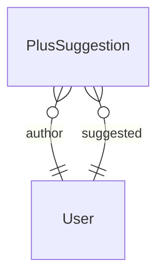

### Notes

- Comments to suggestions are also just suggestions same as new suggestions

## Plus Server Tiers

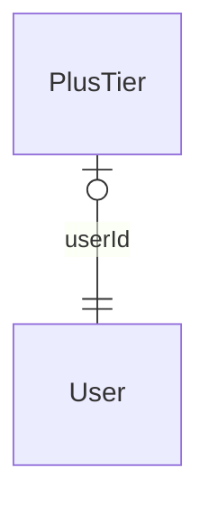

### Views
- **FreshPlusTier** - Calculates Plus Server Tiers based on the latest voting results

### Notes
- PlusTier is just FreshPlusTier materialized for performance reasons with players from the leaderboard added

## Results (maps/head-to-head)

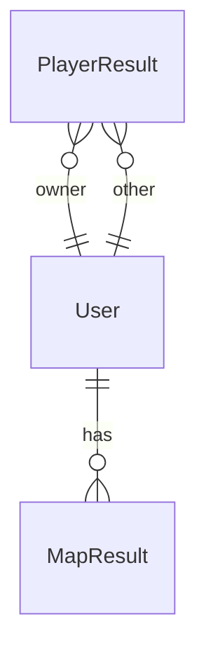

### Notes

- Denormalized tables to make fetching these efficient

## Scrims

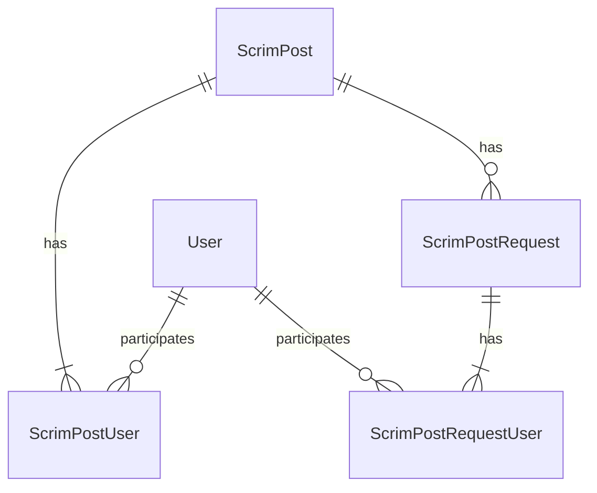

## Teams

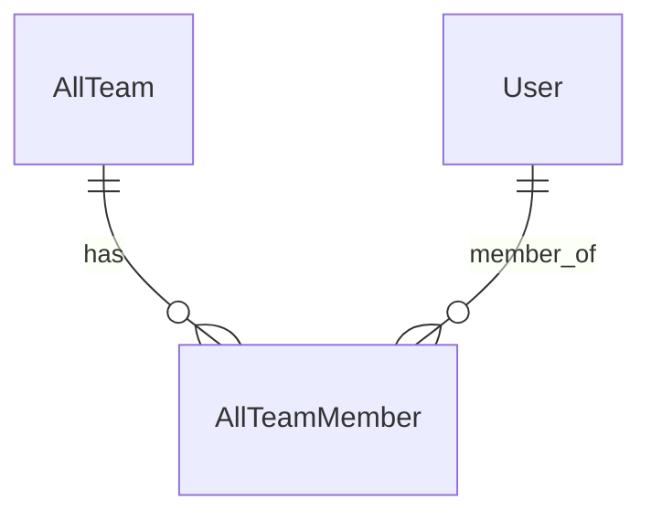

### Views

- **Team** - Teams excluding disbanded
- **TeamMember** - `AllTeamMember` excluding members who already left their team & secondary teams
- **TeamMemberWithSecondary** - `AllTeamMember` excluding members who already left their team but including secondary teams

## Tournaments

The database structure is mimicking the `brackets-manager.js` library. See this issue for a schema: [https://github.com/Drarig29/brackets-manager.js/issues/111#issuecomment-997417423](https://github.com/Drarig29/brackets-manager.js/issues/111#issuecomment-997417423)

## Tournament organizations

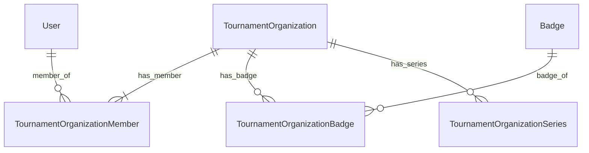

## Videos
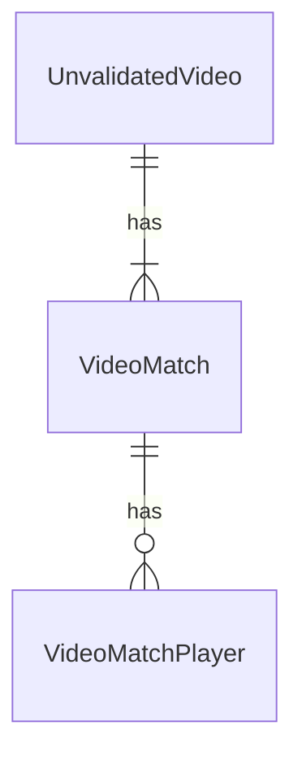

### Notes

- `Video` - Same as `UnvalidatedVideo` (redundant)
