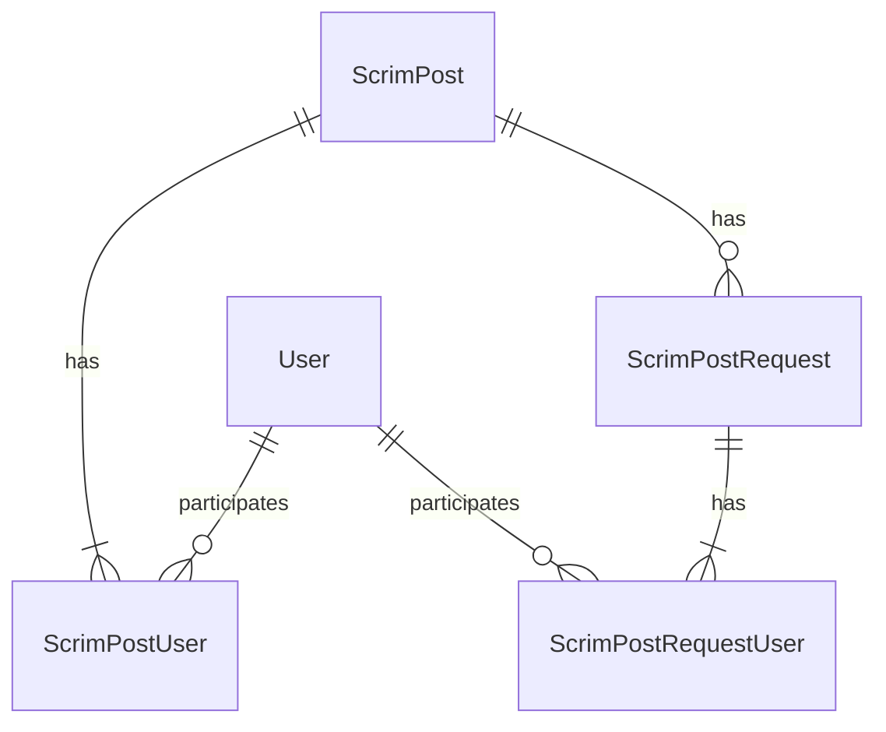

Schemas here

## Scrims

```mermaid
erDiagram
    ScrimPost ||--|{ ScrimPostUser : has
    ScrimPost ||--o{ ScrimPostRequest : has
    ScrimPostRequest ||--|{ ScrimPostRequestUser : has

    User ||--o{ ScrimPostUser : participates
    User ||--o{ ScrimPostRequestUser : participates
```
