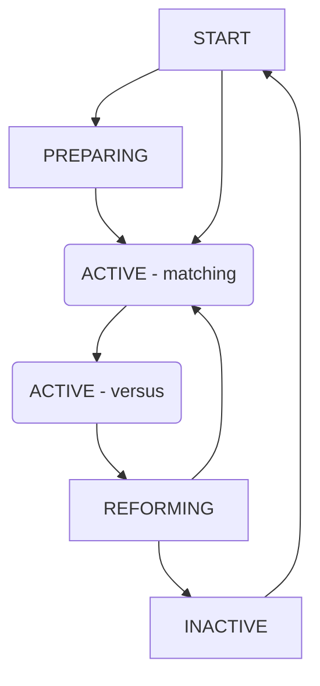

# SendouQ

## Group status

SendouQ group can be in one of the following statuses:

1) PREPARING
2) ACTIVE (matching)
3) ACTIVE (versus)
4) REFORMING
5) INACTIVE

Group is considered active when it is not INACTIVE. User can only be in one active group at a time.

### PREPARING

(might be skipped if user goes straight to group matching)

User can add any number of members without going to the general group forming.

### ACTIVE (matching)

(might be skipped if user adds full group in the PREPARING phase)

User merges with other groups of suitable size till full group is reached. When the group is full then other full groups are challenged till one is accepted.

### ACTIVE (versus)

Match is played out against other group.

### REFORMING

Each member of the group needs to state if they want to look again with the same group or not. Note someone might leave and the partial group might still join to the group forming phase. The old group is set as inactive when the new group is formed or there is only one user left that did not reject the reforming.

### INACTIVE

Group is inactive and only present in the database for archival.

## Hidden groups

Group can be hidden when it is in the group forming status and has not performed any actions in 30 minutes. Group is still considered active, it can't just see other groups and is not visible to other groups.

There is a routine that runs periodically that sets groups that have been hidden for 30 minutes as inactive.
