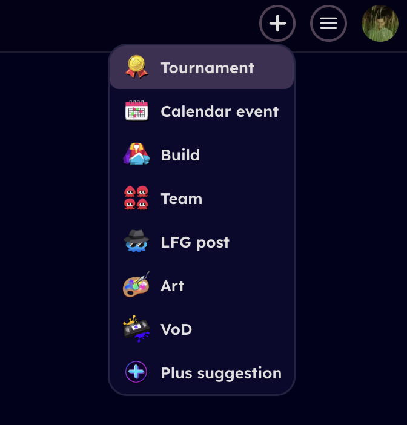

# Creating a tournament

## About

Sendou.ink can used to run Splatoon 3 tournaments without the need of another bracket hosting website. Currently it is in limited beta. You can request access via our Discord if you are an established tournament organizer.

## Creating

Tournaments can be created via the add menu on the top right of your screen after logging in assuming you have access:

## Fields

This section explains all the different options when you are creating a tournament and what they do.

### Name

Name of the tournament.

### Description

Description of the tournament, shown when registering. Supports Markdown including embedding images.

### Rules

Rules of the tournament. Supports Markdown including embedding images.

### Dates

When tournament starts. Note that unlike calendar events, tournaments can only have one actual starting time.

### Discord server invite URL

Invite link URL to your tournament's Discord server.

### Tags

Tags that apply to your tournament. Please take a look at the selection and choose all that apply.

### Logo

Tournament logo you can upload to be shown in various places.

