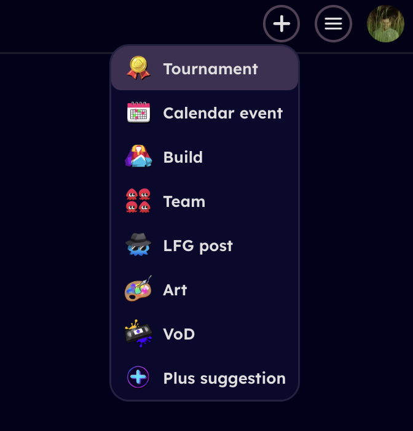
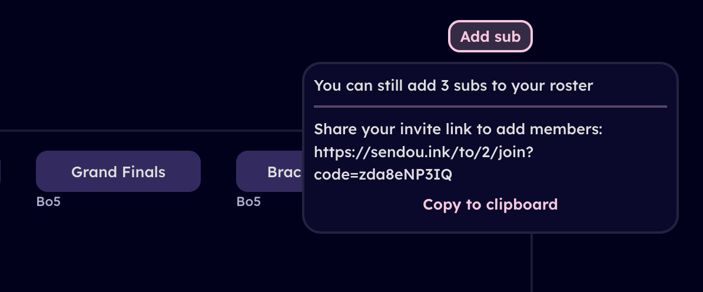
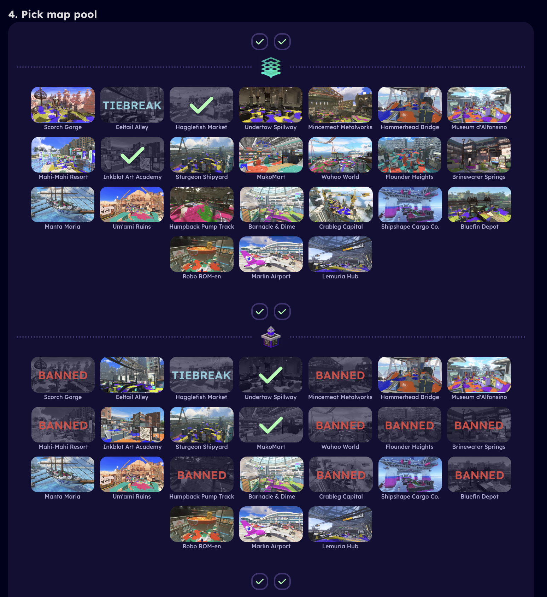
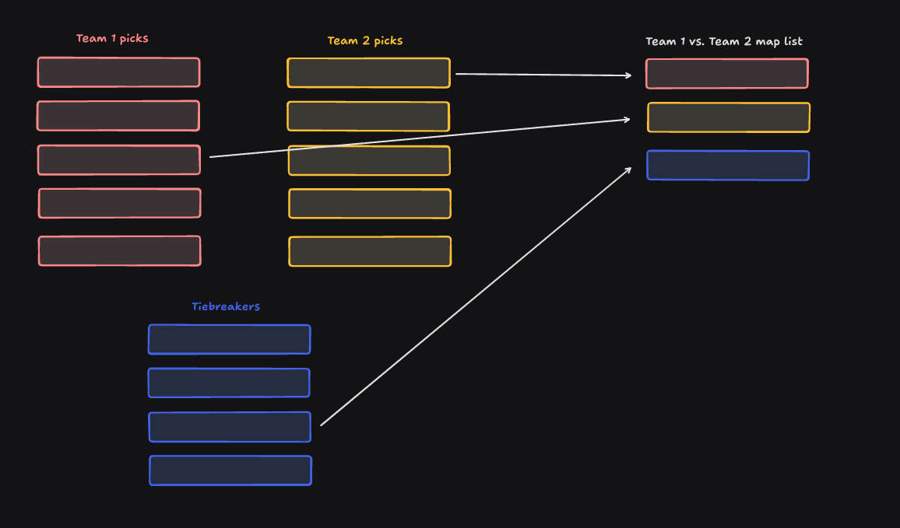
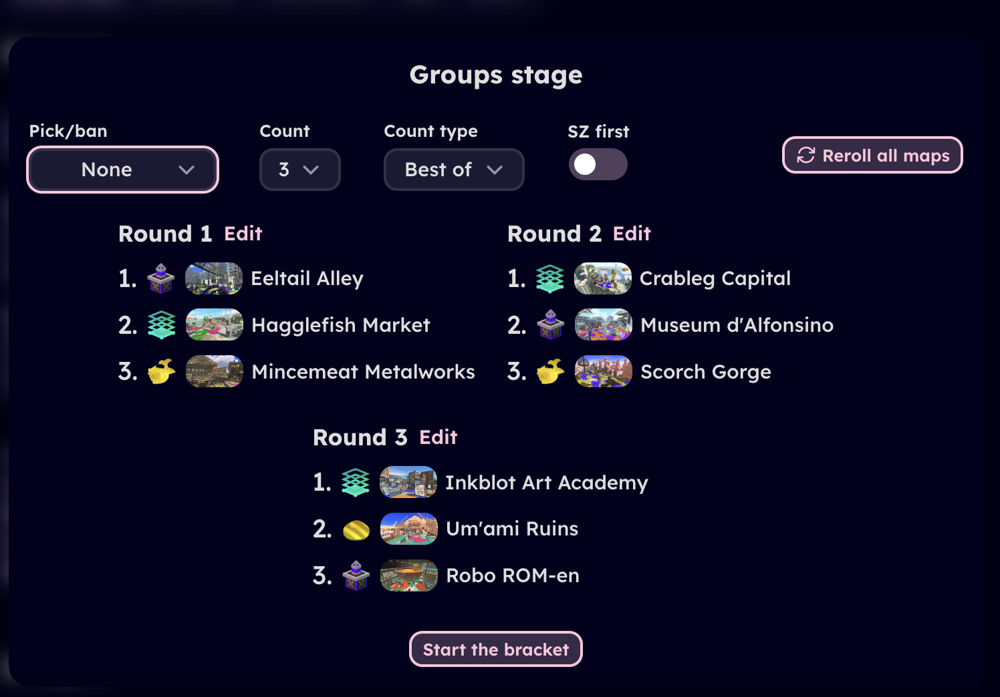
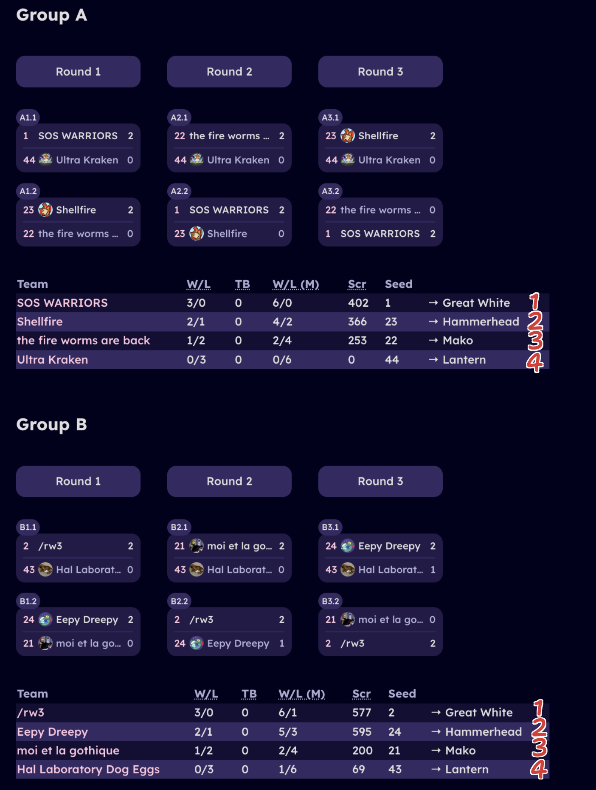

# Creating a tournament

## About

Sendou.ink can used to run Splatoon 3 tournaments without the need of another bracket hosting website. Currently it is in limited beta. Note that you should only make tournaments you host yourself. Creating tournaments on behalf of others is not allowed. Access is available to two groups:

1) Patreon supporters of Supporter tier or above
2) Established organizations

See the /faq page for more information about established organizations.

## Creating

Tournaments can be created via the add menu on the top right of your screen after logging in assuming you have access:

### Using a template

At the top of the form you can select one of your recent tournaments as a template. Doing so copies over its settings (description, rules, tags, format, map picking style etc.) to the new tournament. Badge prizes are only copied if you still manage those badges.

## Fields

This section explains all the different options when you are creating a tournament and what they do.

### Name

Name of the tournament.

### Description

Description of the tournament, shown when registering. Supports Markdown including embedding images.

### Organization

Which organization to host the tournament under. Note that if you do not have global tournament adder permissions (patron perk) you can only host tournaments for organizations that are "established". To host a tournament for such an organization you need either the Admin or Organizer role.

### Rules

Rules of the tournament. Supports Markdown including embedding images.

### Date

When the tournament starts. Note that unlike calendar events, tournaments can only have one actual starting time. Start times for additional brackets are set separately in the tournament format section.

### Discord server invite URL

Invite link URL to your tournament's Discord server.

### Tags

Tags that apply to your tournament. Please take a look at the selection and choose all that apply.

### Badge prizes

Badges awarded to the winners of the tournament. You can only select badges you manage.

### Logo

Tournament logo you can upload to be shown in various places. For non-patrons the logo is shown publicly only after a moderator has checked it.

## Tournament settings

### Players count

Choose whether you want to host a regular 4v4 tournmament or 3v3/2v2/1v1 tournament.

### Max team size

Only shown for 4v4 tournaments. The maximum number of players a team can have on their roster, between 4 and 10 (default 6). The limit does not apply to tournament organizers adding players to a team, they can add up to 12. For 3v3/2v2/1v1 the roster size is always exactly the team size.

### Registration closes at

Choose relative to the tournament start time when sign ups close. When the registration closes new teams can't sign up, add team members or change their registration info. All of this is still possible via admin actions regardless of whether the registration is open or not.

New sub posts can also no longer be made after registration closes, unless registration is set to close at the start time, in which case subs can be posted until the tournament is finalized.

### Ranked

Host the event as ranked or not. Ranked tournaments affect SP and contribute to the seasonal rankings. A tournament hosted during off-season is always unranked no matter what is chosen here, and so are 3v3/2v2/1v1 and test tournaments. Some events are not allowed to be run as ranked:

- Gimmick rules (some weapon restrictions is fine for example "no duplicate specials")
- Skill capped in any way

If you are not sure whether your event qualifies to be ran as ranked, ask before hosting.

### Splattercolor Screen toggle

When enabled, Splattercolor Screen is banned in a match if the teams' accessibility preferences call for it.

### LFG tab

Allow participants to look for more members via the LFG feature and sign up as subs (after registration is closed). With this off there is no LFG tab and no subs list.

### Autonomous subs

Allow teams to add subs while the tournament is in progress on their own. If off then all the subs have to be added by the tournament organizers.

*Tournament team member adding a sub in the middle of a tournament*

### Require in-game names

Especially for tournaments where verification is important. Players need to have submit an in-game name (e.g. Sendou#1234) and this can't be changed after registration closes.

### Invitational

All teams added by the tournament organizer manually. No open registration and no subs list.

### Test

Test tournaments are for dry-run testing. They don't appear on the calendar, don't send notifications to players, and won't show up in players' profiles or results. Test mode cannot be changed after creation and the tournament will never become a real tournament. The toggle is only available when creating a new tournament, not when editing.

### Draft

Draft mode hides the tournament from the calendar and front page. Only organizers can see and access it. This is useful for preparing a tournament privately before making it visible to participants.

The tournament must be opened before any bracket can be started. To open a draft tournament, edit it on /calendar/new and disable the draft toggle. Once opened it can't be put back into draft mode.

Unlike test mode, draft tournaments are fully functional once opened: they appear on the calendar, affect rankings/results, and behave like any other tournament.

#### Draft vs Test

| Feature | Draft | Test |
|---------|-------|------|
| Visible on calendar | No (until opened) | No (never) |
| Accessible to organizers | Yes | Yes |
| Accessible to anyone with link | No (until opened) | Yes |
| Can be opened later | Yes | No |
| Affects rankings/results | Yes (once opened) | No (never) |
| Bracket can be started | Only after opening | Yes |
| Toggle editable after creation | Yes (until opened) | No |
| Purpose | Prepare tournament privately | Dry-run testing |

## Tournament maps

With sendou.ink tournaments all maps are decided ahead of time. The map picking style can't be changed after the tournament has been created.

### Prepicked by teams

Map pool is always the same as current SendouQ seasonal map pool in terms of bans.

For SZ/TC/RM/CB only no maps are picked by the tournament organizer. Teams pick 6 maps of that mode.

For all modes the tournament organizer picks one tiebreaker map per mode. Teams pick 2 maps per mode.

*Team picking maps as part of their registration process*

Then when the tournament in in progress an algorithm decides the map list for each match:

[More info on how it works](https://gist.github.com/sendou-ink/285c697ad98171243bf5c08a4c7e1f30).

### Picked by TO

Note that here you select just the map pool. The actual map lists are picked when the bracket starts (or prepared) in advance:

*View when starting bracket*

## Tournament format

Choose the tournament format. You can have at most 10 brackets with teams advancing between them as you wish.

Source bracket means a bracket where teams come from. Target bracket means a bracket where teams go to after first playing some other bracket. A bracket can be both at the same time.

### Bracket options

Each bracket has a name and a format (single elimination, double elimination, round robin or Swiss). Depending on the format some extra options appear:

- **Single elimination**: whether to have a third place match.
- **Round robin**: max teams per group. Teams are distributed equally so groups may end up smaller than the selected number. Starting round robin brackets can also have **A/B divisions** where teams are split into an A and a B pool and every A team plays every B team once (requires an even amount of teams per group).
- **Swiss**: group count and round count. **Early advance/elimination** can be enabled so that teams stop playing once they reach the required amount of wins or exceed the maximum amount of losses. With it on you also pick how many wins are needed to advance, and the target bracket doesn't take placements (the teams that hit the threshold advance).

### Teams join from

Each bracket takes its teams either from the sign-up or from another bracket.

If "Sign-up" is selected the bracket is a starting bracket. You can set which teams start from which bracket in the seeding page. Note that when you have more than one starting bracket you are creating a tournament where teams that start in separate brackets will never meet (so in essence they are separate tournaments but just happening on the same tournament page).

If "Another bracket" is selected you pick one or more source brackets and which placements advance from each of them.

### Placements

Placements is a comma separated list of placements. So e.g. the following are valid:

- `1,2,3` - places 1, 2 and 3
- `1-4` - places 1 to 4
- `5+` - place 5 and every place after it
- `-1,-2` - teams eliminated in (losers) rounds 1 & 2, elimination brackets only

Placements are relative in the sense that the amount of teams that sign up don't affect them. `1` is always the 1st placement but `2` is the "2nd best possible placement to achieve" and so on. So for example with round robin the amount of teams advancing from that bracket depends entirely on the amount of groups (which is decided via sign ups.)

*A screenshot from one Swim or Sink and how the placements map*

### Start time

Whether to start the bracket right after the previous one concludes or at some other time. This can be useful for two day tournaments. Note that it's not really meant to organize an event that spans many weeks (organization page features can be used instead). Only available for brackets that take their teams from another bracket.

### Check-in required

Whether to require check-in to the bracket or not. Note even if you leave it off, you can still check out teams. Check-in starts 1 hour before the bracket's start time, or right after the previous bracket finishes if no start time is set. Only available for brackets that take their teams from another bracket.

### Editing the format later

The format can be edited on /calendar/new until the tournament starts. After it has started the format can still be edited by an admin of the tournament on the bracket admin page, but brackets that have already started can no longer be changed or removed, and which brackets are starting brackets is locked in.

### Limitations

Current limitations. Feel free to leave feedback if it's blocking you from running some event you wish:

- At most 10 brackets per tournament.
- Teams that start in different brackets can never meet, so routes coming from separate starting brackets can't merge into the same bracket.
- Brackets can't source each other in a loop and the same source bracket can only be used once per target bracket.
- Negative placements (teams dropping out in the losers rounds) are only available when the source bracket is single or double elimination. A single source can't mix positive and negative placements.
- Placements can't have gaps (e.g. if 1st and 3rd advance somewhere then 2nd must also) and the same placement can't be sent to two different brackets.
- The highest placement that can be used is 100.
- A/B divisions are only available on starting round robin brackets.
- The final bracket can't be a Swiss bracket with more than one group.
